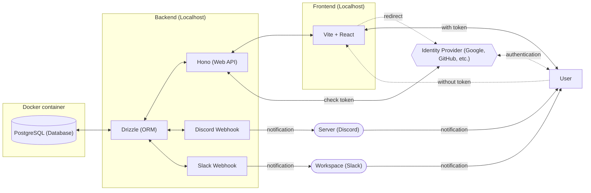

# pay-crew

[](https://github.com/Myxogastria0808/pay-crew/actions/workflows/test.yaml)
[](https://github.com/Myxogastria0808/pay-crew/actions/workflows/docs.yaml)


[](#)

## セットアップ

0. いくつかのツールをインストール

- docker-compose
- Docker
- Node.js
- pnpm
- vscode
- vscode extensions
  - `astro-build.astro-vscode`
  - `esbenp.prettier-vscode`
  - `dbaeumer.vscode-eslint`
  - `clinyong.vscode-css-modules`

1. このレポジトリをクローン

```sh
git clone https://github.com/Myxogastria0808/pay-crew.git
cd pay-crew
```

2. レポジトリのルートに`.env`ファイルを作成

`.env.example`を参考に適当な値を設定してください。

3. コンテナを起動

```sh
sudo docker compose up -d
```

4. 以下のコマンドを実行

```sh
pnpm i && pnpm run setup:generate && pnpm run backend:generate && pnpm run backend:migrate
```

## docker-compose の操作 (基本操作のみ掲載)

### 起動

```sh
sudo docker compose up -d
```

### コンテナに入る

```sh
sudo docker exec -it postgres psql -U <POSTGRES_USER> -d <POSTGRES_DB>
```

<POSTGRES_USER> と <POSTGRES_DB> には、.env ファイルで設定した値を入力する。

例: .env の設定例を使っている場合は以下のようになる。

```sh
sudo docker exec -it postgres psql -U postgres -d sample
```

### 停止

```sh
sudo docker compose down
```

### クリーンアップ

```sh
docker compose down --rmi all --volumes
```

## API情報の更新

1. `openapi.json`を更新

```sh
pnpm run backend:openapi
```

2. `orval`を実行して、コードを生成

```sh
pnpm run frontend:orval
```

## 本番環境 (Xata Lite) のマイグレーション

1. `products/backend/.env`を本番環境のURLに変更

2. 以下のコマンドを実行

```sh
pnpm run backend:migrate
```

3. `products/backend/.env`を開発環境のURLに戻す

## ドキュメント

https://myxogastria0808.github.io/pay-crew/

## 技術スタック

### Frontend (products/frontend)

- TypeScript
- CSS Modules
- Vite + React
- React Router (for routing)
- react-hook-form (for form handling)
  - validator: Zod (with @hookform/resolvers)
- Orval (for generating API client and mock from OpenAPI spec)
  - fetch API (for data fetching)
  - SWR (for data fetching)
  - MSW (mocking API)
- Sentry (for error tracking)

#### [Live Demo](https://pay-crew.yukiosada.work/)
- https://pay-crew.yukiosada.work/

#### [Source Code](https://github.com/Myxogastria0808/pay-crew/tree/dev/products/frontend/)
- https://github.com/Myxogastria0808/pay-crew/tree/dev/products/frontend/

#### [Details](https://github.com/Myxogastria0808/pay-crew/tree/dev/products/frontend/README.md)
- https://github.com/Myxogastria0808/pay-crew/tree/dev/products/frontend/README.md

#### [Vitest UI Report](https://myxogastria0808.github.io/pay-crew/vitest/frontend/)
- https://myxogastria0808.github.io/pay-crew/vitest/frontend/

#### [Coverage Report](https://myxogastria0808.github.io/pay-crew/coverage/frontend/)
- https://myxogastria0808.github.io/pay-crew/coverage/frontend/

### Backend (products/backend)

- TypeScript
- Hono (Web Framework)
- @hono/zod-openapi (for validation and OpenAPI spec generation)
- fetch API (for calling Webhook)
- Drizzle (ORM)

### [Web UI for OpenAPI](https://pay-crew-api.yukiosada.work/docs)
- https://pay-crew-api.yukiosada.work/docs

### [OpenAPI Spec](https://pay-crew-api.yukiosada.work/openapi)
- https://pay-crew-api.yukiosada.work/openapi

#### [Source Code](https://github.com/Myxogastria0808/pay-crew/tree/dev/products/backend/)
- https://github.com/Myxogastria0808/pay-crew/tree/dev/products/backend/

#### [Details](https://github.com/Myxogastria0808/pay-crew/tree/dev/products/backend/README.md)
- https://github.com/Myxogastria0808/pay-crew/tree/dev/products/backend/README.md

#### [Vitest UI Report](https://myxogastria0808.github.io/pay-crew/vitest/backend/)
- https://myxogastria0808.github.io/pay-crew/vitest/backend/

#### [Coverage Report](https://myxogastria0808.github.io/pay-crew/coverage/backend/)
- https://myxogastria0808.github.io/pay-crew/coverage/backend/

### Database

- development
  - PostgreSQL with docker-compose
- production
  - Xata Lite

### Docs (docs)

- Astro

#### [Docs](https://github.com/Myxogastria0808/pay-crew/tree/dev/docs/)
- https://github.com/Myxogastria0808/pay-crew/tree/dev/docs/

#### [Details](https://github.com/Myxogastria0808/pay-crew/tree/dev/docs/README.md)
- https://github.com/Myxogastria0808/pay-crew/tree/dev/docs/README.md

### Setup (setup)

- TypeScript

#### [Source Code](https://github.com/Myxogastria0808/pay-crew/tree/dev/setup/)
- https://github.com/Myxogastria0808/pay-crew/tree/dev/setup/

#### [Details](https://github.com/Myxogastria0808/pay-crew/tree/dev/setup/README.md)
- https://github.com/Myxogastria0808/pay-crew/tree/dev/setup/README.md

### Validator (products/paycrew-validator)

- TypeScript
- Zod

#### [Source Code](https://github.com/Myxogastria0808/pay-crew/tree/dev/products/paycrew-validator/)
- https://github.com/Myxogastria0808/pay-crew/tree/dev/products/paycrew-validator/

#### [Details](https://github.com/Myxogastria0808/pay-crew/tree/dev/products/paycrew-validator/README.md)
- https://github.com/Myxogastria0808/pay-crew/tree/dev/products/paycrew-validator/README.md

## CI/CD

- GitHub Actions with Nix

#### [CI/CD](https://github.com/Myxogastria0808/pay-crew/tree/dev/.github/workflows/)
- https://github.com/Myxogastria0808/pay-crew/tree/dev/.github/workflows/

## テストツール

- Vitest

## 開発ツール

> [!WARNING]
> このプロジェクトは、 pnpmのみサポートしています。 npmやyarnなどはサポートしていません。

- pnpm (with workspace feature)
- turbo (monorepo management tool)
- Nix (optional tool)

## システム構成図 ~ 開発環境 ~



## システム構成図 ~ 本番環境 ~


## ER図

```mermaid
```

## ブランチ戦略

### main

main branch is the release branch.

### dev

dev branch is the development root branch.


### feature

- feat/#[issue-number]-[issue-summary]

  example) feat/#12-add-card-button-component

### chore

- chore/#[issue-number]-[issue-summary]

  example) chore/#12-add-prettier-config

### fix

- fix/#[issue-number]-[issue-summary]

  example) fix/#12-change-title

### update

- update/#[issue-number]-[issue-summary]

  example) update/#12-update-dependencies

### test

- test/#[issue-number]-[issue-summary]

  example) test/#12-add-unit-test

```mermaid
flowchart LR
    feature["feat/*"]
    chore["chore/*"]
    fix["fix/*"]
    update["update/*"]
    dev["dev"]
    test["test/*"]
    main["main"]
    feature --with checks--> dev
    chore --with checks--> dev
    fix --with checks--> dev
    update --with checks--> dev
    dev --with checks--> main
    test --with checks--> dev
    main --with checks (cron)--> main
```

#### with checks (`dev branch`)

- test (`push` and `pull requests`)
- CodeQL Scanning
- docs (`push`)
- preview-frontend (`pull requests`)

#### with checks (`main branch`)

- test (`pull requests`)
- CodeQL Scanning
- deploy-frontend (`push`)
- deploy-backend (`push`)

#### with `checks (cron)` (`main branch`)

- test (`cron`)
