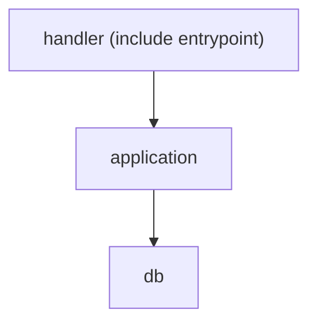
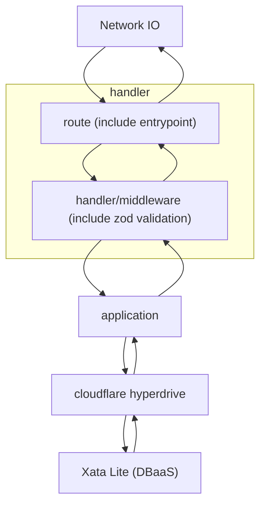

# pay-crew Backend

## 構造

この構造は、レイヤードアーキテクチャから着想を得て定義している。

このプロジェクトでは、hyperdriveによってDB接続が抽象化されており、
drizzleというORMを使用してDB操作も抽象化しているため、インフラストラクチャ層は
用意していない。

### handler (handler/routeを含む)

ルーティングの定義を行う。

- 外部依存
  - hono
  - @hono/zod-openapi
  - zod-openapi-share

### handler/middleware

ミドルウェアの定義を行う。

Zodによるバリデーションも実際はミドルウェアとして実装されているはずだが、
このプロジェクトではhandler/routeに直接組み込んでいる。

- 外部依存
  - hono

### application

ビジネスロジック及びデータベースCRUD操作の定義を行う

- 外部依存
  - drizzle

### db

データベーススキーマの定義を行う

- 外部依存
  - Drizzle

## 依存関係

## 処理の流れ

