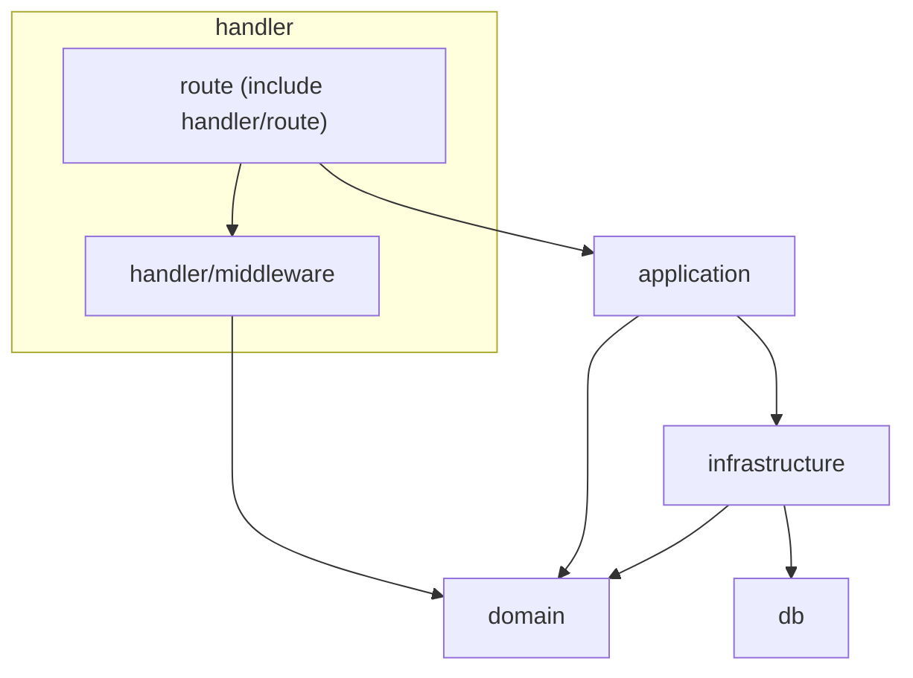
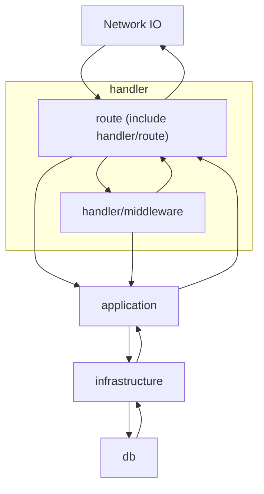

# pay-crew Backend

## 構造

この構造は、レイヤードアーキテクチャから着想を得て定義しています。

### handler (handler/routeを含む)

ルーティングの定義を行う

- 外部依存
  - Hono

### handler/middleware

ミドルウェアの定義を行う

- 外部依存
  - Hono

### application

ビジネスロジックの定義を行う

- 外部依存

### domain

モデル（データベーススキーマではない）と型の定義を行う

### infrastructure

データベースCRUD操作の定義を行う

> [TIP!]
> 全ての操作は、最小の操作となるように定義する

- 外部依存
  - Drizzle

### db

データベーススキーマの定義を行う

- 外部依存
  - Drizzle

## 依存関係

## 処理の流れ

